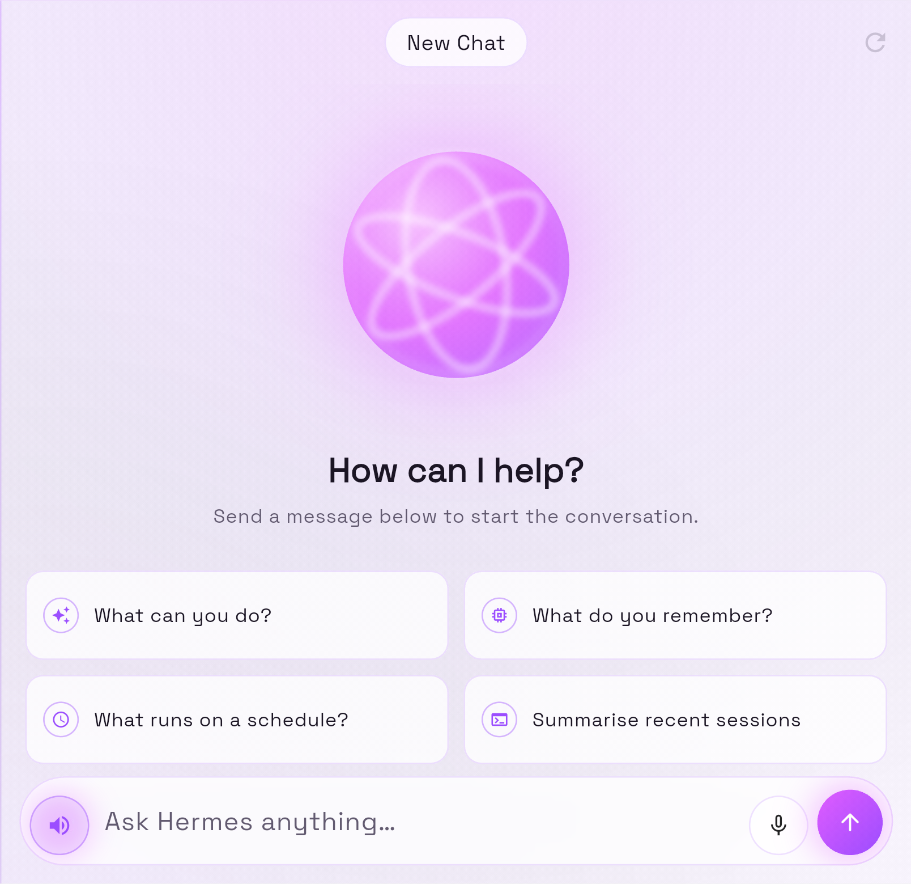

# Hermes Android — Plasma UI

A **design fork** of [rusty4444/hermes-android](https://github.com/rusty4444/hermes-android), the
Android/iOS client for [Hermes Agent](https://hermes-agent.nousresearch.com/).

This fork changes only how the app *looks*. Every screen, route and network call behaves exactly as
upstream — the gateway client, the SSE streaming chat, the dashboard auth modes and the session
management are untouched. What is new is a design system: a neon magenta accent bloomed over near
black ink, frosted glass surfaces, and an animated plasma orb as the brand mark.

For product documentation — installing the APK, running the Gateway API Server, Tailscale and
reverse-proxy setup, troubleshooting — see the
[upstream README](https://github.com/rusty4444/hermes-android/blob/main/README.md). That material is
not duplicated here.



*New session, light mode, on the inner display of a Galaxy Z Fold. The pinned session panel sits to
the left of this crop.*

## The design

Two reference images drove the direction: a dark voice-assistant screen with a magenta orb glowing
under a bloom, and a purple assistant home with a two-up grid of glass suggestion cards. The palette
is taken from the first.

### Palette

| Token | Value | Role |
| --- | --- | --- |
| `hermesMagenta` | `#E05CFF` | Primary neon; dark-mode `colorScheme.primary` |
| `hermesViolet` | `#9B4DFF` | Gradient far end; light-mode `colorScheme.primary` |
| `hermesPlasma` | `#F7B8FF` | Rim highlights on the orb and focused chrome |
| `hermesCyan` | `#4DE8F5` | "Live" status — active sessions, running cron jobs, enabled skills |
| `hermesAlert` | `#FF5C8A` | Errors, in place of stock Material red |
| `hermesInk` | `#08070C` | Dark canvas |
| `hermesMist` | `#F6F2FB` | Light canvas — tinted paper, not white |

Type is **Orbitron** for the `HERMES` wordmark and **Space Grotesk** for everything else, both via
`google_fonts`.

### Structure

Everything colour- or shape-related lives in [`lib/core/theme.dart`](lib/core/theme.dart), so a
restyle is a single-file change rather than a sweep through every screen. On top of it sit five
widget files:

| File | What it provides |
| --- | --- |
| [`widgets/aurora.dart`](lib/core/widgets/aurora.dart) | The ambient backdrop, plus `AuroraScaffold` — a transparent `Scaffold` over it, so the glow runs unbroken behind the app bar |
| [`widgets/plasma_orb.dart`](lib/core/widgets/plasma_orb.dart) | The brand mark: a `CustomPainter` sphere with filaments drifting across it |
| [`widgets/glass.dart`](lib/core/widgets/glass.dart) | `GlassCard`, `NeonIconButton`, `GradientPillButton`, `GradientOrbButton`, `BrandPill`, `FaintIconButton`, `SectionLabel` |
| [`widgets/brand_hero.dart`](lib/core/widgets/brand_hero.dart) | Orb over wordmark, for empty states |
| [`widgets/status_view.dart`](lib/core/widgets/status_view.dart) | Loading / error / empty states and snack bars, shared by every screen |

### Screen by screen

- **Home** — plasma orb empty state; saved connections as glass cards with a gradient router avatar
  and a lock badge showing whether an API key is stored.
- **Chat** — the session name rides in a capsule. An empty conversation shows the orb over a grid of
  starter prompts. The composer is a blurred glass pill holding the voice controls and a gradient
  send orb. User messages are lit gradient capsules; the assistant answers from a frosted panel.
- **Sessions** — glass cards, with a glowing dot on live sessions and a hollow ring on dormant ones.
- **Memory / Cron / Skills / Settings** — glass cards on the aurora, under `SectionLabel` headers.

Both brightnesses are first-class. Light mode keeps the same composition at roughly 40% of the bloom
strength, so it reads as tinted paper rather than a dimmed dark theme.

## Constraints this design works within

- **No new dependencies.** Glass, glow, gradients and the orb are all Flutter primitives —
  `BackdropFilter`, `ShaderMask`, `CustomPainter`, `AnimationController`. `pubspec.yaml` is unchanged
  from upstream.
- **Upstream architecture is preserved.** Navigation stays `Navigator.push`, state stays
  `StatefulWidget` + `setState`. No routing or state-management library was introduced.
- **Reduced motion is respected.** The orb holds a single frame when the platform asks for it.
- **Fonts are fetched at runtime** by `google_fonts`. With no network on first launch the app falls
  back to platform fonts; layout is unaffected. This matches upstream behaviour.

## Build

```bash
flutter pub get
dart analyze --fatal-infos
flutter test
flutter build apk --release
```

`dart analyze --fatal-infos` reports no issues and all 57 tests pass. Tests cover the design tokens,
the shared status views, the streaming buffer and the connection manager.

One testing note worth knowing: the orb animates continuously, so the widget tree never settles and
`pumpAndSettle` would hang. Widget tests pump a fixed number of frames instead.

## Attribution

The application is the work of [rusty4444](https://github.com/rusty4444) and its contributors. This
fork contributes only the visual design layer and is not affiliated with or endorsed by the upstream
project.

Upstream publishes no licence file, so all rights remain with the original author. This fork exists
under GitHub's Terms of Service, which permit forking public repositories. Please consult the
upstream author before reusing this code beyond that.
